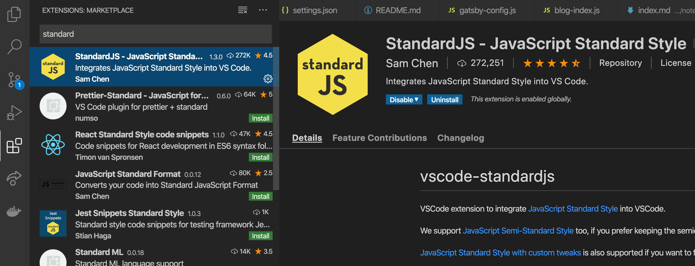
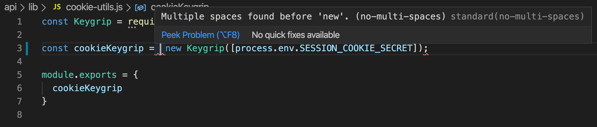
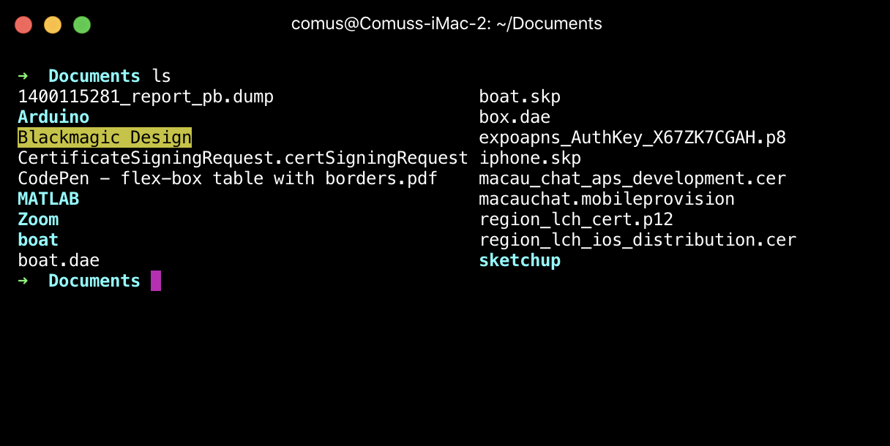

我簡單講講我的開發環境，所用的東西等等，希望給大家做個參考。

## 1. VS Code

這是 Windows 最強大的發明。我用它來做網頁開發。

## 2. Standard JS

官網: https://standardjs.com/

我有一隊共同開發專案的團隊，因此我們需要有共同的編寫語言的習慣。

所以解決方法是安裝 standard js。用 standard 的好處就是格式都照他的，我們完全不用想，我們的編寫 js 的格式都照 standard 的風格。

```
yarn add standard babel-eslint --dev
```

然後在 package.json 加上

```
{
  "standard": {
    "parser": "babel-eslint"
  }
}
```

最重要的是，連 VS Code 也安裝 StandardJS 的插件。



這樣就能在 VS Code 編寫 Javascript 時, VS Code 就能提提你哪裡的格式有問題。



## 3. Hyper

我的命令提示字元，即 terminal，用的是 Hyper。也是 ZEIT 公司發明的。

官網: https://hyper.is/



比一般的 terminal 好用方便吧。而且也簡單好看。

## 4. Sourcetree

因為我記不住 git 的指令。所以我用上了 Sourcetree.

官網: https://www.sourcetreeapp.com/

## 5. 今天要介紹的 NodeJS library

之後每次有文章我都介紹一下我覺得有趣的 library。

- [zeit-ui/react](https://github.com/zeit-ui/react)
  - An unofficial UI organization. 意思他是參照 ZEIT 這家公司的 ui 自己弄出來的。所以不是官方的。
- [facebookexperimental/rome](https://github.com/facebookexperimental/rome)
  - 看來 facebook 想弄一個實驗性的 Javascript 編譯器出來。
- [tannerlinsley/react-query](https://github.com/tannerlinsley/react-query)
  - Hooks for fetching, caching and updating asynchronous data in React
- [bvaughn/react-error-boundary](https://github.com/bvaughn/react-error-boundary)
  - Simple reusable React error boundary component, 因為 react v16 有介紹到 [error boundaries](https://reactjs.org/docs/error-boundaries.html) 的技術，**如果不知道什麼是 error boundaries 的話確實要了解一下**。
- [zeit/swr](https://github.com/zeit/swr)
  - React Hooks library for remote data fetching

---
