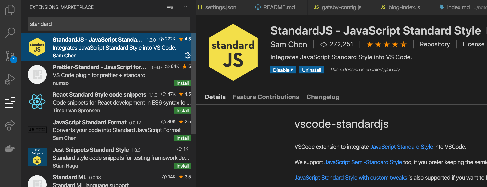
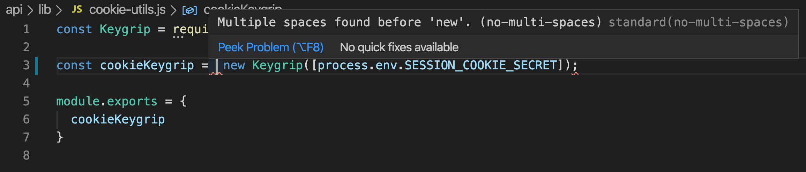

我简单讲讲我的开发环境，所用的东西等等，希望给大家做个参考。

## 1. VS Code

这是 Windows 最强大的发明。我用它来做网页开发。

## 2. Standard JS

官网: https://standardjs.com/

我有一队共同开发专案的团队，因此我们需要有共同的编写语言的习惯。

所以解决方法是安装 standard js。用 standard 的好处就是格式都照他的，我们完全不用想，我们的编写 js 的格式都照 standard 的风格。

```
yarn add standard babel-eslint --dev
```

然后在 package.json 加上

```
{
  "standard": {
    "parser": "babel-eslint"
  }
}
```

最重要的是，连 VS Code 也安装 StandardJS 的插件。



这样就能在 VS Code 编写 Javascript 时, VS Code 就能提提你哪里的格式有问题。



## 3. Hyper

我的命令提示字元，即 terminal，用的是 Hyper。也是 ZEIT 公司发明的。

官网: https://hyper.is/


比一般的 terminal 好用方便吧。而且也简单好看。

## 4. Sourcetree

因为我记不住 git 的指令。所以我用上了 Sourcetree.

官网: https://www.sourcetreeapp.com/

## 5. 今天要介绍的 NodeJS library

之后每次有文章我都介绍一下我觉得有趣的 library。

- [zeit-ui/react](https://github.com/zeit-ui/react)
  - An unofficial UI organization. 意思他是参照 ZEIT 这家公司的 ui 自己弄出来的。所以不是官方的。
- [facebookexperimental/rome](https://github.com/facebookexperimental/rome)
  - 看来 facebook 想弄一个实验性的 Javascript 编译器出来。
- [tannerlinsley/react-query](https://github.com/tannerlinsley/react-query)
  - Hooks for fetching, caching and updating asynchronous data in React
- [bvaughn/react-error-boundary](https://github.com/bvaughn/react-error-boundary)
  - Simple reusable React error boundary component, 因为react v16 有介绍到[error boundaries](https://reactjs.org/docs/error-boundaries.html) 的技术，**如果不知道什么是error boundaries 的话确实要了解一下**。
- [zeit/swr](https://github.com/zeit/swr)
  - React Hooks library for remote data fetching

---