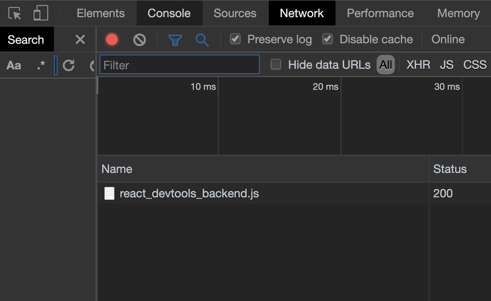

作為開發者，有新的 library 要嘗試並加入到自己的專案，或者偵測為什麼自己寫的程式碼錯誤。這兩樣東西幾乎是每天發生的。我以同為開發者的角度，去分享我怎麼處理這兩件事情。

## 嘗試新的 library

1. 看官網的，看英文的先。通常如果這個 library 多人用的話，一定會有官網。如果有中文和英文選的話，我一定會看英文。因為中文通常都是協作者義工翻譯的，沒有英文的文檔更新的那麼快，而且很多時候專有名詞也翻譯的怪怪的。

2. 通常這個 lib 一定會有 github，看他 github 的 readme 說什麼。

3. 如果他有 github 或官網，有可能會有個單元是教你 getting started (如何開始)。通常是以最少量的步驟教會你如何用他的 lib。就開個新專案照著他們所說的做一次就對了。而且他的 github 已經有他們寫好的名為 demo 或 examples 的範例，就看看能不能在自己的電腦裡運行吧。不要第一就想把這個 lib 加入到你已有的 project 先，先以照著他們的教程和範例試試能不能在你電腦運行和得到結果為大前提。

4. 如果以上三步都不能讓你了解這個新 lib，就找找 google 的文章，或 youtube 的影片，看看有沒有牛人有分享什麼教程吧。

> **記住！沒有捷徑的，這是邏輯，像數學題，你能看過數學的教學影片就能自己操題去考試嗎？不行吧，對不了解的事情，實行吧，就不斷開新 project 不斷試這些新 lib，不要急著整合到你已在的專案，不斷試試到你覺得用起來很輕鬆，就算有錯誤也知道自己寫錯什麼為止吧。**

## 偵測為什麼自己寫的程式碼錯誤

我必須再三強調！

> 我每天都會寫有錯誤的程式碼！
>
> 我每天都會寫有錯誤的程式碼！
> 
> 我每天都會寫有錯誤的程式碼！

唯一的解決的辦法不是讓自己寫不會有錯誤的程式碼，而是讓自己至少有基本的偵錯能力。

當我在寫程式碼時，突然之間，發現有錯誤，我會怎麼做？

1. 看看 terminal 的錯誤訊息講的是什麼，這是最基本的吧，如果你能從錯誤訊息看得懂自己寫錯了什麼/忽略了什麼，那麼我恭喜你。但以我為例，我有一半時間都不明白 terminal 寫的錯誤是講啥的，那你可以參考下一步。

2. 排除法第一招，例如是寫到一半發現有錯誤，那試試把剛剛寫的東西 comment (註解)掉吧，然後再試試看，如果沒有錯誤了，就「證明」錯誤是剛剛新增的程式碼所引起的吧。那就逐行解除註解，再試，再解除註解，再試。試到你發現原來錯誤是從第幾行產生的。

3. 排除法第二招，「還原」，通常我們的 project 都是有版本控制，即 git。例如我知道上一次 push 上 github 時是沒有錯誤的，現在我修改了 10 個檔案，變成有錯誤，那很簡單，還原到上一個你覺得沒有錯誤的版本，然後你小心的逐個修改的檔案改一點點，再試，改一點點，再試，最後你就知道令你有問題的是哪一個檔案了。所以我是強烈不建議改了三四十個檔案才 commit 一次，改兩三四個檔案，試過沒問題就 commit 一次，方便自己還原到一個比較接近現在版本的地方。

4. debug 大招，很簡單，如果我有錯誤，我確定是某一個檔案或某一個 function 出問題，那就把這個檔案佈滿 `console.log`。看看程式碼在運行時到哪裡斷了。

```jsx{2,4,6,8,10}
function aaa () {
  console.log(111, a, b)
  fn(a, b)
  console.log(222, c, c)
  fn2(c, d)
  console.log(333, a, b, c, d)
  for (let i = 0; i < 10; i++>) {
    console.log(444, i)
    const doc = _.find({ i })
    console.log(555, doc)
  }
}
```

像這樣，運行測試，如果 terminal 只印 `111`, `222`, 沒有 `333`，就能證明是 `fn2` 出了問題吧。

5. Google Chrome 瀏覽器或許能幫你，就對網頁按右鍵，Inspect(檢查)，看看 console 有什麼錯誤訊息，看看 network 有什麼檔案運行不了。或許找到一些線索。



6. 重啟大招，如果什麼都不行，那就重啟 server，重啟瀏覽器，重啟電腦。

7. 問，問網絡。有錯誤訊息，在 Google 裡搜，不要在百度。通常開發的東西在 Google 搜會比較好，因為那些 lib 都要外國人發明的。這裡要看你平常在 Google 搜東西的能力或分析搜出來網頁是不是你需要的能力。搜的關鍵字很重要。例如我有時搜東西會加引號 `"insert error" "postgresql" "next.js"` 等等。

8. 不是最後，問，問人，好過自己找幾天都解決不了，問身邊的開發者吧。

> **同樣地，沒有捷徑的。每天我遇到錯誤我都跟著這個步驟一步步去偵錯。比起一有錯誤就問為什麼會錯，為什麼會 undefined，鍛練自己的偵錯能力吧。因為，這是，開發者，最基本的，能力。至少我是照這個偵錯流程用了很多年。**