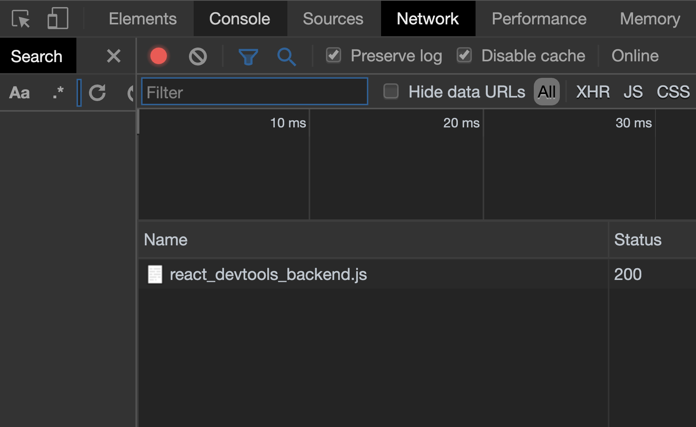

作为开发者，有新的 library 要尝试并加入到自己的专案，或者侦测为什么自己写的程式码错误。这两样东西几乎是每天发生的。我以同为开发者的角度，去分享我怎么处理这两件事情。

## 尝试新的 library

1. 看官网的，看英文的先。通常如果这个 library 多人用的话，一定会有官网。如果有中文和英文选的话，我一定会看英文。因为中文通常都是协作者义工翻译的，没有英文的文档更新的那么快，而且很多时候专有名词也翻译的怪怪的。

2. 通常这个 lib 一定会有 github，看他 github 的 readme 说什么。

3. 如果他有 github 或官网，有可能会有个单元是教你 getting started (如何开始)。通常是以最少量的步骤教会你如何用他的 lib。就开个新专案照着他们所说的做一次就对了。而且他的 github 已经有他们写好的名为 demo 或 examples 的范例，就看看能不能在自己的电脑里运行吧。不要第一就想把这个 lib 加入到你已有的 project 先，先以照着他们的教程和范例试试能不能在你电脑运行和得到结果为大前提。

4. 如果以上三步都不能让你了解这个新 lib，就找找 google 的文章，或 youtube 的影片，看看有没有牛人有分享什么教程吧。

> **记住！没有捷径的，这是逻辑，像数学题，你能看过数学的教学影片就能自己操题去考试吗？不行吧，对不了解的事情，实行吧，就不断开新project 不断试这些新lib，不要急着整合到你已在的专案，不断试试到你觉得用起来很轻松，就算有错误也知道自己写错什么为止吧。**

## 侦测为什么自己写的程式码错误

我必须再三强调！

> 我每天都会写有错误的程式码！
>
> 我每天都会写有错误的程式码！
>
> 我每天都会写有错误的程式码！

唯一的解决的办法不是让自己写不会有错误的程式码，而是让自己至少有基本的侦错能力。

当我在写程式码时，突然之间，发现有错误，我会怎么做？

1. 看看 terminal 的错误讯息讲的是什么，这是最基本的吧，如果你能从错误讯息看得懂自己写错了什么/忽略了什么，那么我恭喜你。但以我为例，我有一半时间都不明白 terminal 写的错误是讲啥的，那你可以参考下一步。

2. 排除法第一招，例如是写到一半发现有错误，那试试把刚刚写的东西comment (注解)掉吧，然后再试试看，如果没有错误了，就「证明」错误是刚刚新增的程式码所引起的吧。那就逐行解除注解，再试，再解除注解，再试。试到你发现原来错误是从第几行产生的。

3. 排除法第二招，「还原」，通常我们的 project 都是有版本控制，即 git。例如我知道上一次push 上github 时是没有错误的，现在我修改了10 个档案，变成有错误，那很简单，还原到上一个你觉得没有错误的版本，然后你小心的逐个修改的档案改一点点，再试，改一点点，再试，最后你就知道令你有问题的是哪一个档案了。所以我是强烈不建议改了三四十个档案才 commit 一次，改两三四个档案，试过没问题就 commit 一次，方便自己还原到一个比较接近现在版本的地方。

4. debug 大招，很简单，如果我有错误，我确定是某一个档案或某一个 function 出问题，那就把这个档案布满 `console.log`。看看程式码在运行时到哪里断了。

```jsx{2,4,6,8,10}
function aaa () {
  console.log(111, a, b)
  fn(a, b)
  console.log(222, c, c)
  fn2(c, d)
  console.log(333, a, b, c, d)
  for (let i = 0; i < 10; i++>) {
    console.log(444, i)
    const doc = _.find({ i })
    console.log(555, doc)
  }
}
```

像这样，运行测试，如果 terminal 只印 `111`, `222`, 没有 `333`，就能证明是 `fn2` 出了问题吧。

5. Google Chrome 浏览器或许能帮你，就对网页按右键，Inspect(检查)，看看 console 有什么错误讯息，看看 network 有什么档案运行不了。或许找到一些线索。



6. 重启大招，如果什么都不行，那就重启 server，重启浏览器，重启电脑。

7. 问，问网络。有错误讯息，在 Google 里搜，不要在百度。通常开发的东西在 Google 搜会比较好，因为那些 lib 都要外国人发明的。这里要看你平常在 Google 搜东西的能力或分析搜出来网页是不是你需要的能力。搜的关键字很重要。例如我有时搜东西会加引号 `"insert error" "postgresql" "next.js"` 等等。

8. 不是最后，问，问人，好过自己找几天都解决不了，问身边的开发者吧。

> **同样地，没有捷径的。每天我遇到错误我都跟着这个步骤一步步去侦错。比起一有错误就问为什么会错，为什么会 undefined，锻练自己的侦错能力吧。因为，这是，开发者，最基本的，能力。至少我是照这个侦错流程用了很多年。**